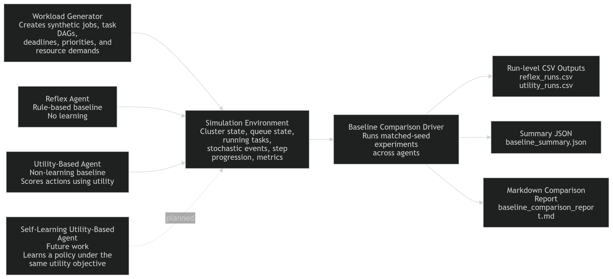
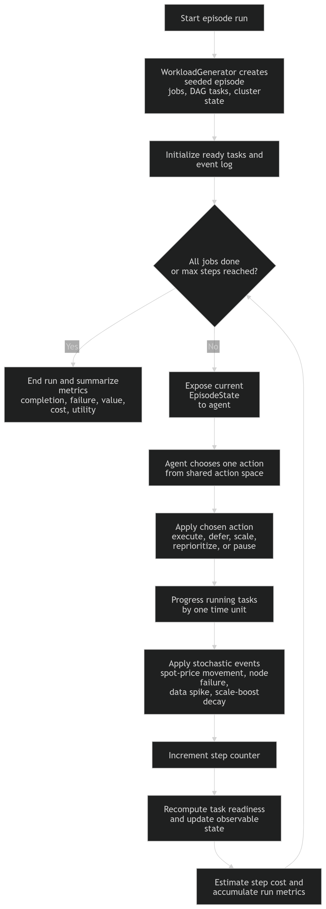
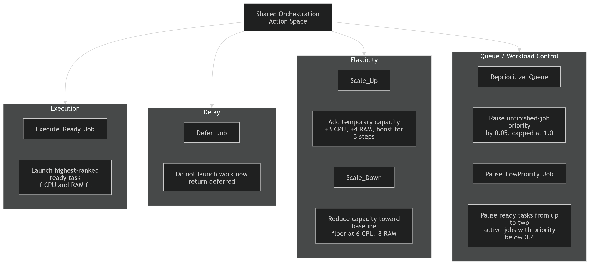
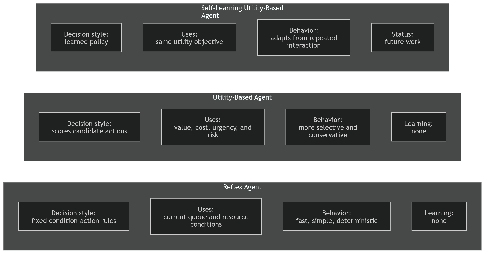
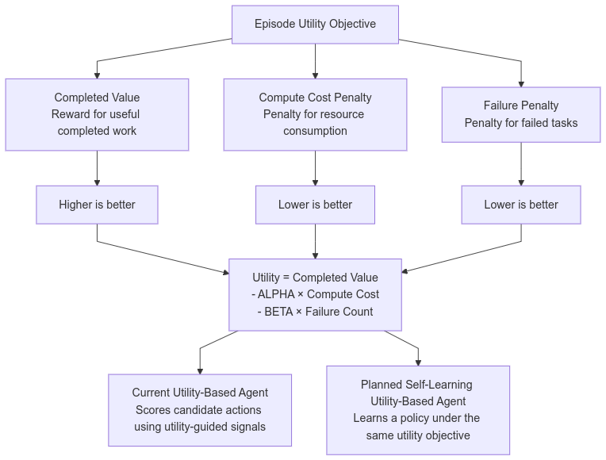
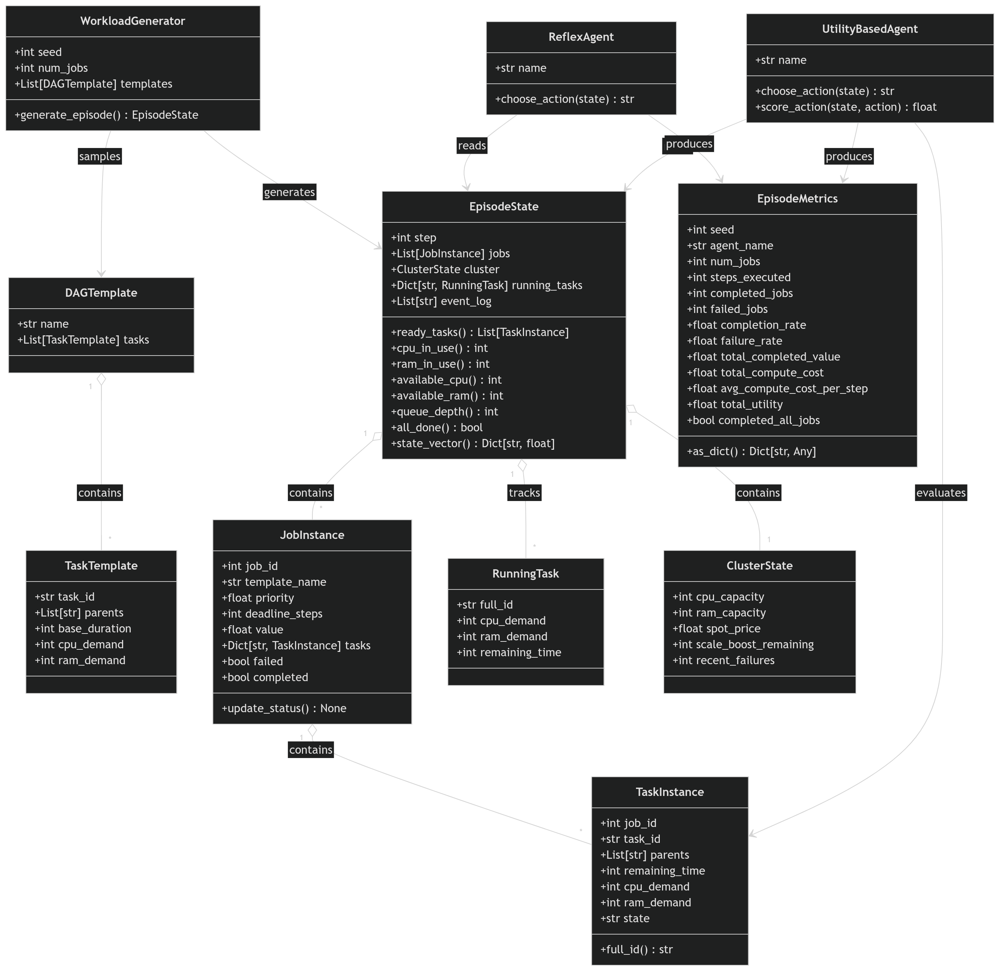
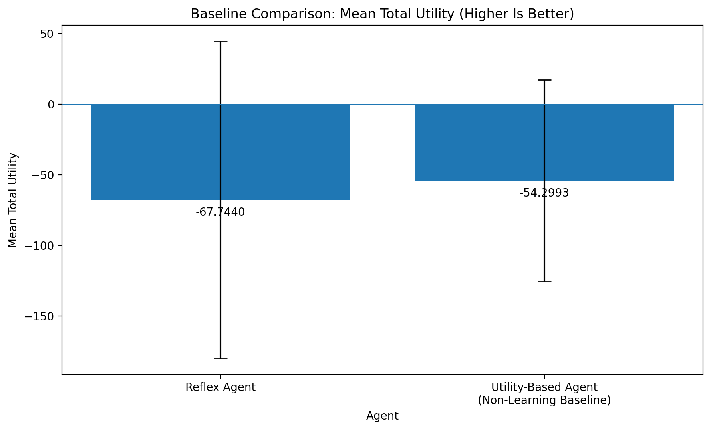
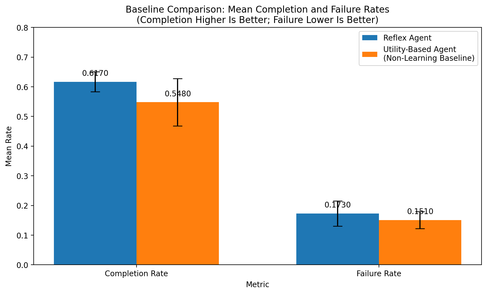
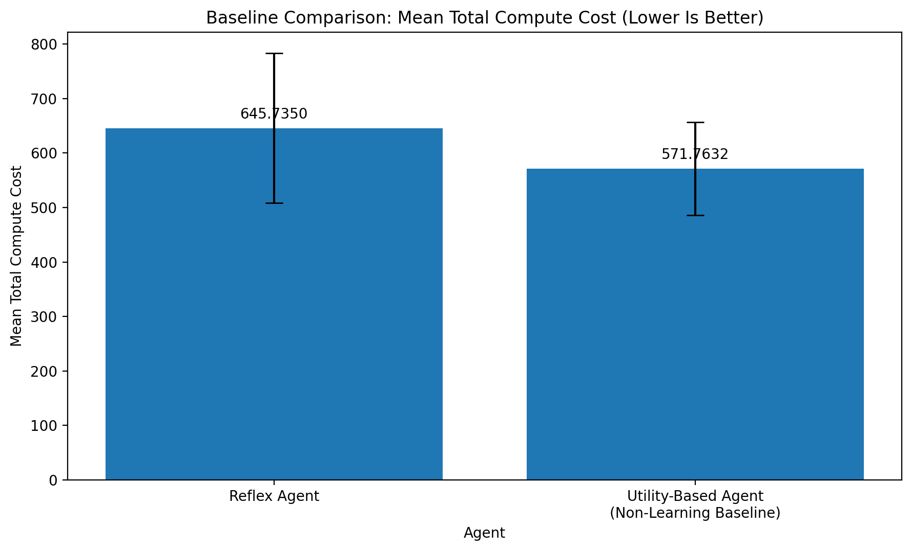
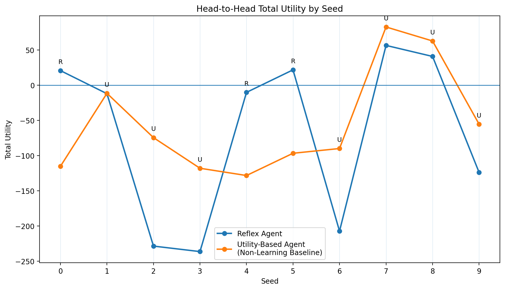

# Design of a Self-Learning Utility-Based Agent for Adaptive Data Pipeline Orchestration in Resource-Constrained Cloud Environments

A simulation-based project for studying how different orchestration policies behave under changing workload pressure, limited resources, variable spot-price conditions, and execution failures.

> **Current status:** v0 simulator implemented, Reflex baseline implemented, non-learning Utility-Based baseline implemented, baseline comparison workflow completed, Self-Learning Utility-Based Agent planned for the next stage.
>
> **Evidence status:** All measured results in this README come from the current v0 baseline stage only: the simulator, the Reflex Agent, and the non-learning Utility-Based Agent. The Self-Learning Utility-Based Agent is planned future work and is not part of the current quantitative results.

---

## Contents

- [Executive Overview](#executive-overview)
- [Quick Start](#quick-start)
- [System Architecture Overview](#system-architecture-overview)
- [Current Status](#current-status)
- [Problem Statement and Research Motivation](#problem-statement-and-research-motivation)
- [Research Objective](#research-objective)
- [Repository Structure](#repository-structure)
- [Environment Design](#environment-design)
- [Action Space](#action-space)
- [Agent Designs](#agent-designs)
- [Utility Formulation](#utility-formulation)
- [Code Structure Snapshot](#code-structure-snapshot)
- [Experimental Setup](#experimental-setup)
- [Metrics](#metrics)
- [Baseline Results](#baseline-results)
- [How to Run](#how-to-run)
- [Reproducibility Notes](#reproducibility-notes)
- [Progressive Update Log](#progressive-update-log)
- [Roadmap](#roadmap)
- [References](#references)

---

## Executive Overview

Modern data pipelines do not run in fixed conditions. Queue pressure changes, resources get tight, spot prices move, and failures happen at the wrong time. In a setting like that, orchestration is not just a static scheduling problem. It becomes a sequential decision problem: the same action can help in one state and hurt in another.

This project studies that idea through a stochastic simulation environment for adaptive data pipeline orchestration. The current codebase includes two implemented baselines:

- a **Reflex Agent**, which follows fixed hand-written rules
- a **Utility-Based Agent (Non-Learning Baseline)**, which scores candidate actions using a fixed utility-guided rule that weighs value, cost, urgency, and risk

The longer-term goal is to add a **Self-Learning Utility-Based Agent** that keeps the same overall objective but learns a better policy from repeated interaction with the simulator. That matters because it makes the later comparison cleaner: if the objective stays the same, then any improvement can be attributed more directly to the policy-learning step rather than to a changed target.

The current baseline results already show a real trade-off. The utility-based baseline improves mean total utility and lowers both cost and failure rate, but it also completes a smaller share of jobs than the reflex baseline. That is a useful result for this stage. It shows that the simulator is rich enough to expose nontrivial behavior, and it gives a clear reason to keep going with sensitivity analysis and a learned policy.

---

## Quick Start

Run the full baseline comparison:

```bash
python compare_baselines_v0.py
```

This writes the current baseline artifacts to:

```text
baseline_results_v0/
```

The default run uses:

- seeds `0` through `9`
- `100` jobs per run
- `300` max steps per run

---

## System Architecture Overview



*Figure 1. High-level architecture of the current project. Synthetic workloads are generated, executed inside a stochastic simulation environment, and evaluated under matched seeds with the Reflex Agent and the non-learning Utility-Based Agent. The output stage produces run-level CSV files, a summary JSON file, and a Markdown comparison report. The Self-Learning Utility-Based Agent is planned future work.*

At a high level, the project has four main layers:

1. **Workload generation** — create synthetic jobs with DAG structure, priorities, deadlines, and resource demands.
2. **Simulation environment** — track runtime state, queue pressure, available capacity, spot price, and random events.
3. **Agent policies** — choose one orchestration action at each step through the same environment interface.
4. **Evaluation pipeline** — run matched-seed experiments and summarize behavior into CSV, JSON, and Markdown outputs.

That separation is one of the stronger parts of the project. The simulator defines the world, the agents define the policy, and the comparison script handles the evaluation. That keeps the baseline study fair and makes later extension to a learning-based agent much easier.

---

## Current Status

### Implemented

- stochastic simulation environment for adaptive data pipeline orchestration
- workload generation with job/task structure and resource-constrained cluster state
- six-action orchestration interface covering execution, deferral, scaling, reprioritization, and pausing low-priority work
- **Reflex Agent** baseline
- **Utility-Based Agent (Non-Learning Baseline)**
- matched-seed baseline comparison pipeline with CSV, JSON, and Markdown outputs
- README figures and result charts for the current v0 stage

### Evaluated so far

- **10** runs per agent
- seeds **0** through **9**
- **100** jobs per run
- **300** max steps per run

### Current baseline finding

Compared with the Reflex Agent, the current Utility-Based Agent has:

- better **mean total utility**
- lower **mean total compute cost**
- lower **mean failure rate**
- lower **mean completion rate**

That suggests the current utility policy is more conservative. It saves cost and avoids some risky behavior, but it also leaves some throughput on the table.

### Next stage

- utility-weight sensitivity analysis
- implementation of the **Self-Learning Utility-Based Agent**
- offline training and evaluation in the same simulator
- final three-agent comparison under the same metric framework

---

## Problem Statement and Research Motivation

Most workflow systems are good at dependency handling, retries, and scheduled execution, but their operating behavior is still often driven by fixed rules and manually chosen thresholds. That is fine in stable settings. It becomes less convincing when the environment is stochastic and resource-constrained.

In this project, the agent is not only deciding what can run next. It is deciding whether running, deferring, scaling, reprioritizing, or pausing work is actually a good idea at the current moment. That decision depends on competing pressures:

- **pipeline value** — finishing useful work
- **compute cost** — not spending too much for execution
- **failure risk** — avoiding unstable or failure-prone behavior

Those pressures are built directly into the simulator. The environment includes dependency-aware jobs, bounded CPU and RAM, moving spot-price conditions, random node failures, data spikes, and temporary scaling effects. Because of that, the project is not just comparing two schedulers on a flat queue. It is testing policies inside a changing orchestration setting where trade-offs are unavoidable.

The main research idea is a three-agent framing:

1. a **Reflex Agent** baseline based on fixed rules
2. a **Utility-Based Agent (Non-Learning Baseline)** with a fixed hand-designed scoring policy
3. a planned **Self-Learning Utility-Based Agent**

The key design choice is that the non-learning and self-learning utility-based agents are meant to share the same underlying utility objective. That keeps the later comparison honest. The question is not only whether utility-aware control differs from fixed rules. The sharper question is whether a learned policy can find better value-cost-risk trade-offs than both a rule-based baseline and a fixed utility-based baseline in the same environment.

---

## Research Objective

The main objective of this project is to test whether a self-learning utility-based orchestration agent can achieve better trade-offs among pipeline value, compute cost, and failure risk than both:

- a static **Reflex Agent** baseline
- a fixed **Utility-Based Agent (Non-Learning Baseline)**

At the current stage, the repository establishes the baseline needed for that later comparison. The simulator is implemented, the two current baselines are working, and the evaluation pipeline already produces reproducible run outputs and summary files.

The current baseline outcome is already informative. The utility-based baseline improves mean total utility, lowers mean cost, and lowers mean failure rate, but it also lowers completion rate. That is exactly the kind of intermediate result that makes a learning-based extension worth testing.

---

## Repository Structure

At this stage, the repository is still compact. The main code lives in four source files: the simulator, the Reflex baseline, the Utility-Based baseline, and the comparison driver. The baseline outputs are saved separately so the measured results do not get mixed into the implementation files.

```text
.
├── README.md
├── sim_v0_environment.py
├── reflex_agent_v0.py
├── utility_agent_v0.py
├── compare_baselines_v0.py
├── baseline_results_v0/
│   ├── reflex_runs.csv
│   ├── utility_runs.csv
│   ├── baseline_summary.json
│   └── baseline_comparison_report.md
├── assets/
│   ├── charts/
│   │   ├── baseline_mean_total_utility.png
│   │   ├── baseline_mean_completion_failure.png
│   │   ├── baseline_mean_compute_cost.png
│   │   └── baseline_head_to_head_per_seed.png
│   └── images/
│       ├── architecture_overview.png
│       ├── episode_lifecycle_flowchart.png
│       ├── action_space_map.png
│       ├── agent_comparison_diagram.png
│       ├── utility_formulation_diagram.png
│       └── uml_class_diagram.png
└── V1_0_PRNC_OF_AI_APPS_MID_Report_SUBMIT_.pdf
```

### Core source files

#### `sim_v0_environment.py`
Defines the simulation environment, the action space, the task/job data model, workload generation, cluster state, and step-level environment dynamics.

#### `reflex_agent_v0.py`
Defines the Reflex Agent, the shared episode metrics structure, the utility coefficients used in the current evaluation, step-cost estimation, and helpers for running reflex episodes.

#### `utility_agent_v0.py`
Defines the Utility-Based Agent (Non-Learning Baseline). It scores actions using a fixed rule that combines value, urgency, resource cost, and risk.

#### `compare_baselines_v0.py`
Runs the matched-seed baseline comparison, aggregates the results, and writes the CSV, JSON, and Markdown outputs.

### Suggested reading order

1. `sim_v0_environment.py`
2. `reflex_agent_v0.py`
3. `utility_agent_v0.py`
4. `compare_baselines_v0.py`
5. `baseline_results_v0/baseline_summary.json`
6. `V1_0_PRNC_OF_AI_APPS_MID_Report_SUBMIT_.pdf`

---

## Environment Design



*Figure 2. Step-level lifecycle of a simulation episode. A seeded workload is generated, the current environment state is exposed to the agent, one orchestration action is applied, execution progresses, random events are injected, and the process repeats until all jobs finish or the step budget is exhausted.*

The simulator is built to make orchestration decisions matter. It is not trying to copy a production workflow engine in every detail. The goal is to create a controlled setting where the trade-off among throughput, cost, and failure risk is visible and measurable.

### Core runtime model

The environment is built around a small set of state objects:

- **Task templates** define dependencies, duration, CPU demand, and RAM demand.
- **DAG templates** define reusable workflow shapes.
- **Task instances** and **job instances** hold episode-specific state.
- **Running tasks** represent active runtime execution.
- **Cluster state** tracks CPU capacity, RAM capacity, spot price, temporary scale boosts, and recent failures.
- **Episode state** combines jobs, cluster state, running tasks, the event log, and helper methods for readiness, queue depth, resource usage, and normalized state features.

### Workload generation

Each episode is created from a seed through the workload generator. The current generator samples from three workflow templates:

- a chain workflow
- a fork-join workflow
- a two-stage batch workflow

Generated jobs also receive randomized duration scaling, CPU/RAM scaling, a priority, a deadline, and a completion value. That keeps runs reproducible by seed while still making the workload mix vary.

### State representation

For decision-making, the environment exposes a compact normalized state summary. The current state vector includes signals such as:

- CPU load
- RAM availability
- queue depth
- spot price
- ready DAG nodes
- average active-job priority
- deadline urgency
- recent failures

This is the observation surface used by the current utility-guided policy and the natural place to start for a later learned policy.

### Stochastic dynamics

The simulator includes several sources of uncertainty:

- **spot-price movement**
- **node failure** with probability `0.05`
- **data spikes** with probability `0.08`
- **temporary scaling effects** that decay after a short duration

Together, these make the environment state-dependent in a real way. An action that is sensible under light load and low price may be a bad choice under queue pressure, failure buildup, or high spot price.

### Termination

An episode ends when either:

- all jobs are finished, or
- the run reaches the maximum step budget

In the current baseline study, the default step budget is **300**.

---

## Action Space



*Figure 3. The six orchestration actions grouped by role. The environment allows the agent to execute work, defer, change capacity, reprioritize, or suppress low-priority work instead of forcing a simple run-next-task policy.*

The simulator exposes six orchestration actions:

```python
ACTIONS = [
    "Execute_Ready_Job",
    "Defer_Job",
    "Scale_Up",
    "Scale_Down",
    "Reprioritize_Queue",
    "Pause_LowPriority_Job",
]
```

These actions cover the main kinds of behavior the project cares about:

- **execution control** — decide when to launch ready work
- **delay control** — wait when execution is not worth it yet
- **elasticity control** — add or remove temporary capacity
- **queue management** — shift priority pressure inside the workload
- **workload suppression** — pause low-priority work when needed

That broader action set is important. It gives the baselines room to differ on more than just task selection.

---

## Agent Designs



*Figure 4. Conceptual comparison of the project’s three agent designs. The Reflex Agent uses fixed rules, the current Utility-Based Agent uses a hand-designed utility-guided scoring policy, and the Self-Learning Utility-Based Agent is planned future work under the same objective.*

### Reflex Agent

The Reflex Agent is the simplest baseline in the project. It uses fixed condition-action rules and does not learn from experience. In practice, it tends to:

- execute ready work when at least one task fits current capacity
- scale up under static queue-pressure conditions when price is not too high
- scale down under idle and overprovisioned conditions
- otherwise defer

Its main strength is that it is easy to understand. Its main weakness is that it cannot express fine-grained trade-offs among job value, urgency, cost, and risk.

### Utility-Based Agent (Non-Learning Baseline)

The current utility-based baseline also does not learn, but it uses a richer fixed scoring rule. At each step it evaluates candidate actions using signals tied to:

- projected task value
- deadline urgency
- resource cost
- launch risk
- queue pressure
- recent failures
- spot-price pressure

This makes it more selective than the Reflex Agent. In the current results, that selectivity lowers mean cost and mean failure rate, but it also lowers mean completion rate.

### Planned Self-Learning Utility-Based Agent

The planned next-stage agent is meant to optimize under the same utility objective as the current utility-based baseline, but with a learned policy instead of a fixed hand-designed rule. That is the cleanest way to ask whether learning really helps in this environment.

---

## Utility Formulation



*Figure 5. Shared utility framing for the project. Completed value is rewarded, while compute cost and failures are penalized. The current utility-based baseline and the planned learning-based agent are both tied back to this same overall objective.*

At the episode level, the current evaluation summarizes performance through the following utility objective:

```text
Utility = ALPHA × Completed Value
          - BETA × Total Compute Cost
          - GAMMA × Failed Jobs
```

In the current implementation:

- `ALPHA = 1.0`
- `BETA = 0.4`
- `GAMMA = 0.8`

Two levels should be kept separate:

1. **Episode-level utility** is the shared evaluation target used in the final comparison.
2. **Action-level scoring** inside the current Utility-Based Agent is broader than the final summary metric. It also uses urgency, launch risk, queue pressure, recent failures, and spot-price conditions when selecting the next action.

That distinction is useful. It keeps the reported outcome metric simple without pretending that the internal action heuristic is only one line long.

---

## Code Structure Snapshot



*Figure 6. UML-style view of the current code structure. The project separates template-level workflow definitions, instantiated job/task state, runtime execution state, infrastructure state, workload generation, policy logic, and episode-level metrics.*

The code is still small, but it already has a clean split between environment state, policy logic, and evaluation. That makes it easier to maintain now and easier to extend later when the learning-based agent is added.

---

## Experimental Setup

The current baseline stage uses a matched-seed evaluation setup:

- **number of runs:** 10
- **seeds:** 0 through 9
- **jobs per run:** 100
- **maximum steps per run:** 300
- **agents compared:** Reflex Agent vs. Utility-Based Agent (Non-Learning Baseline)

The comparison driver writes:

- run-level Reflex metrics as CSV
- run-level Utility-Based metrics as CSV
- a machine-readable JSON summary
- a Markdown comparison report

That is enough to make the v0 baseline stage reproducible and easy to inspect.

---

## Metrics

The current evaluation tracks the following episode-level metrics:

- completed jobs
- failed jobs
- completion rate
- failure rate
- total completed value
- total compute cost
- average compute cost per step
- total utility
- steps executed
- completed all jobs

### Step-cost estimate

The current implementation estimates operational cost per step as:

```text
step_cost = spot_price × (0.6 × CPU_in_use + 0.4 × RAM_in_use)
```

Run-level `total_compute_cost` is the sum of these step costs across the full episode.

Together, the metric set covers four things at once:

- throughput
- cost
- risk
- overall objective quality

That is a better fit for this project than reporting only how many jobs finished.

---

## Baseline Results

The current v0 baseline comparison shows a real trade-off instead of a trivial winner.

### Summary table

| Metric | Reflex Agent | Utility-Based Agent (Non-Learning Baseline) | Better direction |
|---|---:|---:|---|
| Mean total utility | -67.7440 | -54.2993 | Higher |
| Mean completion rate | 0.6170 | 0.5480 | Higher |
| Mean failure rate | 0.1730 | 0.1510 | Lower |
| Mean total compute cost | 645.7350 | 571.7632 | Lower |
| Mean total completed value | 204.3900 | 186.4860 | Higher |
| Mean steps executed | 300.0000 | 300.0000 | Lower is usually better |

### Headline takeaways

- The **Utility-Based Agent** has higher mean total utility.
- The **Utility-Based Agent** has lower mean total compute cost.
- The **Utility-Based Agent** has lower mean failure rate.
- The **Reflex Agent** has the higher mean completion rate.
- The Utility-Based Agent wins on total utility in **7 of 10** matched runs.
- The Utility-Based Agent has better completion in only **2 of 10** matched runs.
- The Utility-Based Agent has lower total compute cost in **7 of 10** matched runs.
- Neither baseline completes all jobs in any of the current 10 runs.
- Both baselines use the full **300-step** budget on average in the saved v0 study.

### Visual results



*Figure 7. Mean total utility across the current 10-run baseline comparison. Higher is better. The Utility-Based Agent performs better on this metric on average, although both means remain below zero in the current v0 setup.*



*Figure 8. Mean completion rate and mean failure rate across the current baseline comparison. The Reflex Agent completes more jobs on average, while the Utility-Based Agent fails fewer jobs on average. This is the clearest picture of the current throughput-versus-risk trade-off.*



*Figure 9. Mean total compute cost across the current baseline comparison. Lower is better. The Utility-Based Agent is cheaper on average, which matches its more selective behavior.*



*Figure 10. Head-to-head total utility by matched seed. This makes it easier to see that the utility baseline’s advantage is not only a mean-level effect; it wins on total utility in 7 of the 10 matched runs.*

### What the current results do and do not say

The current results do show that:

- the simulator creates measurable behavioral differences between the two implemented baselines
- the fixed utility-aware policy improves the main combined objective on average
- utility-aware control does not automatically dominate the reflex baseline on completion throughput

The current results do **not** show that:

- the current utility weights are already optimal
- the Utility-Based Agent is the final best policy
- learning is unnecessary

A short summary of the current stage is:

> The non-learning Utility-Based Agent improves overall utility by lowering cost and failure risk, but it appears to under-trade for completion relative to the Reflex baseline.

That is a good baseline result for this stage. It gives the next step a real job to do.

---

## How to Run

### Requirements

- Python 3.10 or newer is recommended.
- The current simulator and baseline scripts use only the Python standard library.

### 1. Run the simulator smoke test

```bash
python sim_v0_environment.py
```

This runs a small built-in demo that:

- creates a seeded episode
- prints the initial state vector
- advances the environment for a few `Execute_Ready_Job` steps
- prints the resulting partial state and event log

### 2. Run the Reflex Agent demo

```bash
python reflex_agent_v0.py
```

This runs a single demo episode with:

- `seed = 7`
- `num_jobs = 20`
- `max_steps = 120`

and prints the episode-level summary.

### 3. Run the Utility-Based Agent demo

```bash
python utility_agent_v0.py
```

This runs the matching single-episode demo with the same basic settings:

- `seed = 7`
- `num_jobs = 20`
- `max_steps = 120`

### 4. Run the full baseline comparison

```bash
python compare_baselines_v0.py
```

By default, this runs:

- seeds `0 1 2 3 4 5 6 7 8 9`
- `100` jobs per run
- `300` max steps per run

and writes:

```text
baseline_results_v0/
├── reflex_runs.csv
├── utility_runs.csv
├── baseline_summary.json
└── baseline_comparison_report.md
```

### 5. Run a custom comparison

Custom seeds:

```bash
python compare_baselines_v0.py --seeds 0 1 2 3
```

Custom job count and step budget:

```bash
python compare_baselines_v0.py --num-jobs 40 --max-steps 150
```

Custom output directory:

```bash
python compare_baselines_v0.py --out-dir results/test_run
```

Fully custom example:

```bash
python compare_baselines_v0.py \
  --seeds 0 1 2 3 4 \
  --num-jobs 60 \
  --max-steps 200 \
  --out-dir results/baseline_custom
```

### 6. Reproduce the saved baseline stage

To reproduce the same baseline configuration reported in this README:

```bash
python compare_baselines_v0.py --seeds 0 1 2 3 4 5 6 7 8 9 --num-jobs 100 --max-steps 300
```

The script prints a Markdown-style summary to the console and then prints the output directory path.

---

## Reproducibility Notes

- episode generation is seed-controlled
- the current baseline comparison is matched by seed across both implemented agents
- the saved run configuration appears in `baseline_results_v0/baseline_summary.json`
- the current README charts should be kept in sync with the saved v0 baseline artifacts
- any future learned-agent results should be added only after the corresponding implementation and outputs actually exist

A good maintenance rule for future updates is:

- update **Current Status** when implementation state changes
- update **Baseline Results** only when new measured evidence exists
- append a new item to **Progressive Update Log** for each milestone
- update **Roadmap** when priorities really change

---

## Progressive Update Log

### v0 — Simulator and baseline validation

- built the stochastic simulation environment
- implemented the Reflex Agent baseline
- implemented the Utility-Based Agent (Non-Learning Baseline)
- added matched-seed evaluation and summary outputs
- added README visuals and baseline result charts

### Planned v1 work

- run utility-weight sensitivity analysis
- implement the Self-Learning Utility-Based Agent
- compare fixed-utility and learned-utility behavior under the same utility objective
- expand reporting and ablation analysis

---

## Roadmap

### Short-term next steps

- stress-test the current utility-weight choices
- implement the learning-based policy layer
- test whether learning improves the value-cost-risk trade-off over both current baselines

### Medium-term improvements

- add richer ablation studies
- analyze policy behavior by workload template and operating regime
- expand result reporting once the learned agent is available

### Longer-term possibilities

- support more workload templates
- extend the infrastructure dynamics beyond the current v0 cloud model
- compare against stronger heuristic baselines

---

## References

### Project artifacts

- `sim_v0_environment.py` — simulator, workload generator, action space, and runtime data model
- `reflex_agent_v0.py` — Reflex baseline, utility summary, and episode metrics
- `utility_agent_v0.py` — non-learning utility-based baseline
- `compare_baselines_v0.py` — matched-seed comparison pipeline
- `baseline_results_v0/baseline_summary.json` — machine-readable result summary used in the statistics reported here
- `baseline_results_v0/reflex_runs.csv` and `baseline_results_v0/utility_runs.csv` — per-run outputs
- `baseline_results_v0/baseline_comparison_report.md` — generated Markdown comparison report
- `V1_0_PRNC_OF_AI_APPS_MID_Report_SUBMIT_.pdf` — project midterm report and next-stage framing

### Note for later expansion

If this repository grows into a final project submission or public project page, the references section can later be expanded with:

- formal citation for the report
- external papers used in the write-up
- links to generated figures or notebooks
- final report or presentation artifacts
